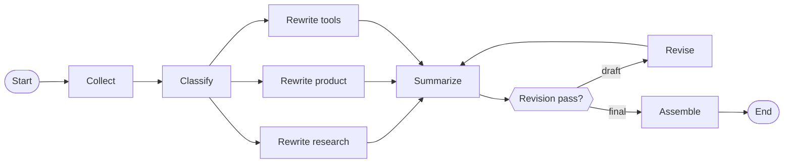

# Top10TechNews

A daily AI / tech digest that turns noisy Hacker News and RSS feeds into a clear **top 10** brief — orchestrated with **[LangGraph](https://langchain-ai.github.io/langgraph/)**.

**Who it's for:** builders, PMs, and researchers who want the signal without scrolling every source.

**Problem it solves:** AI news moves fast and spreads across many feeds. Top10TechNews collects recent updates, sorts them into research / product / tools, rewrites them for skimability, and publishes one short summary you can read in a few minutes.

The pipeline is a **LangGraph** state machine: each stage (collect → classify → rewrite → summarize → revise → assemble) is a graph node, with a revision gate that loops once before the final digest is assembled. A small web UI shows the summary and items in a three-column grid. Digests refresh automatically each day via GitHub Actions and are archived under `history/`.

## How it works

Daily digests run on a GitHub Actions schedule so the site stays current without a manual refresh.

## License

MIT
