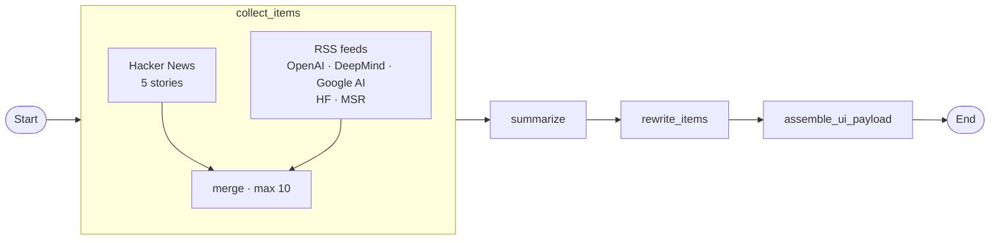

# ConnectSummary

LangGraph pipeline that collects recent AI updates from **Hacker News** and **RSS feeds**, summarizes them, rewrites each item into a clearer short explainer, and serves the result in a compact local UI.

## LangGraph



| Node | Role |
|------|------|
| `collect_items` | Fetch HN stories + RSS posts, merge up to 10 items |
| `summarize` | One-paragraph English brief of all items |
| `rewrite_items` | Rewrite each item in 3–4 clear sentences |
| `assemble_ui_payload` | Build `{ summary, items }` for the UI |

## Setup

Requirements: Python 3.12+, [uv](https://github.com/astral-sh/uv), OpenAI API key.

```bash
cp .env.example .env
# set OPENAI_API_KEY in .env

uv sync
```

`.env` example:

```bash
OPENAI_API_KEY=sk-...
OPENAI_MODEL=gpt-4o-mini
```

## Run

CLI (prints JSON + writes `ui_payload.json`):

```bash
uv run python main.py
```

Local UI:

```bash
uv run python web.py
```

Open [http://127.0.0.1:8765](http://127.0.0.1:8765)

- **Run** — execute the full pipeline
- **Reload** — refresh the page from the last payload
- **See LangGraph** — expand the graph diagram

## Project layout

```text
pipeline.py   # LangGraph state, nodes, edges
main.py       # CLI entrypoint
web.py        # local UI server
.env.example  # env template (no secrets)
```

## Sources

- Hacker News via Algolia API (`search_by_date`, AI-related stories)
- RSS: OpenAI, Google DeepMind, Google AI, Hugging Face, Microsoft Research

## Ideas / next steps

- Deduplicate similar HN + RSS stories before summarize
- Add scheduled runs (cron / GitHub Actions) and keep a history of digests
- Topic filters (robots, research, product launches) with optional routing nodes
- Human-in-the-loop: approve/edit rewritten items before publish
- Deploy the UI (Fly/Railway) + persist payloads in SQLite
- Optional Bluesky source alongside HN/RSS

## License

MIT
