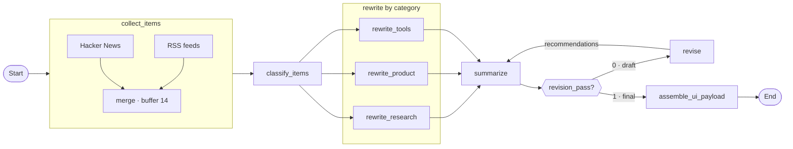

# Top10TechNews

LangGraph pipeline that collects recent AI / tech updates from **Hacker News** and **RSS**, classifies them into **research / product / tools**, rewrites each route, drafts a summary, then **revises** (drops noisy items + recommendations) and loops back to **summarize** once for the final brief.

The UI shows the summary and items in a 3-column card grid. Daily digests can be archived under `history/` via GitHub Actions.

## LangGraph



| Node | Role |
|------|------|
| `collect_items` | Fetch HN + RSS (buffer), then revise keeps exactly 10 |
| `classify_items` | Label each item: research / product / tools |
| `rewrite_research` / `rewrite_product` / `rewrite_tools` | Parallel rewrite routes (3–4 sentences) |
| `summarize` | Draft summary, then regenerate once using revise recommendations |
| `revision_pass?` | `0` → go to revise; `1` → go to assemble / end |
| `revise` | Keep exactly 10 items, drop the rest, emit recommendations, loop back to summarize |
| `assemble_ui_payload` | Build UI JSON + optional history file |

## Daily schedule + archive

No need to click **Run** / **Reload** every day. The site updates itself:

1. GitHub Actions (`.github/workflows/daily-digest.yml`) runs daily at **07:00 UTC** (`workflow_dispatch` also works).
2. It runs `uv run python cli.py`, writes `history/YYYY-MM-DD.json` + `history/latest.json`, and commits/pushes.
3. That push redeploys Vercel. On cold start the app loads committed `history/latest.json` (see `web.load_payload`) — no UI click required.

**One-time setup**

1. Repo → **Settings → Secrets and variables → Actions** → add `OPENAI_API_KEY` (same key as Vercel).
2. Keep **Actions** enabled; the workflow already has `permissions: contents: write` so it can push `history/`.
3. Confirm Vercel is connected to this GitHub repo / `main` so history commits trigger a redeploy.

Manual **Run** on the site still works for an on-demand refresh (writes to `/tmp` on Vercel only).

## Deploy (Vercel)

- Entrypoint: `app.py` (FastAPI)
- Env: `OPENAI_API_KEY` (optional `OPENAI_MODEL`) — also required as a **GitHub Actions** secret for the daily job
- `vercel.json` sets `maxDuration: 300` for the pipeline

## Project layout

```text
app.py                              # FastAPI / Vercel entry
pipeline.py                         # LangGraph state, nodes, edges
cli.py                              # CLI + history write
web.py                              # HTML UI helpers + local server
history/                            # digest archive
.github/workflows/daily-digest.yml  # daily cron
vercel.json                         # Vercel function config
requirements.txt                    # Vercel install
```

## License

MIT
